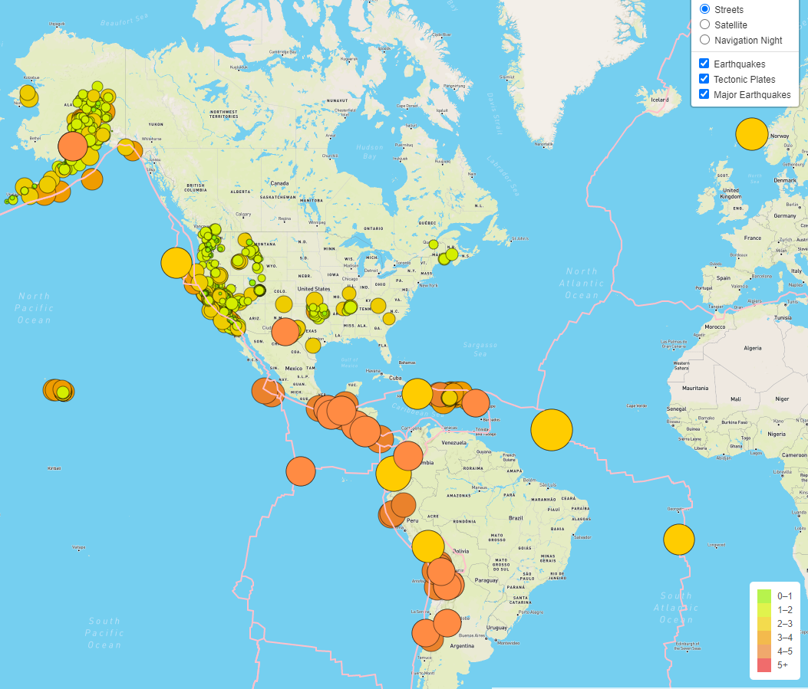
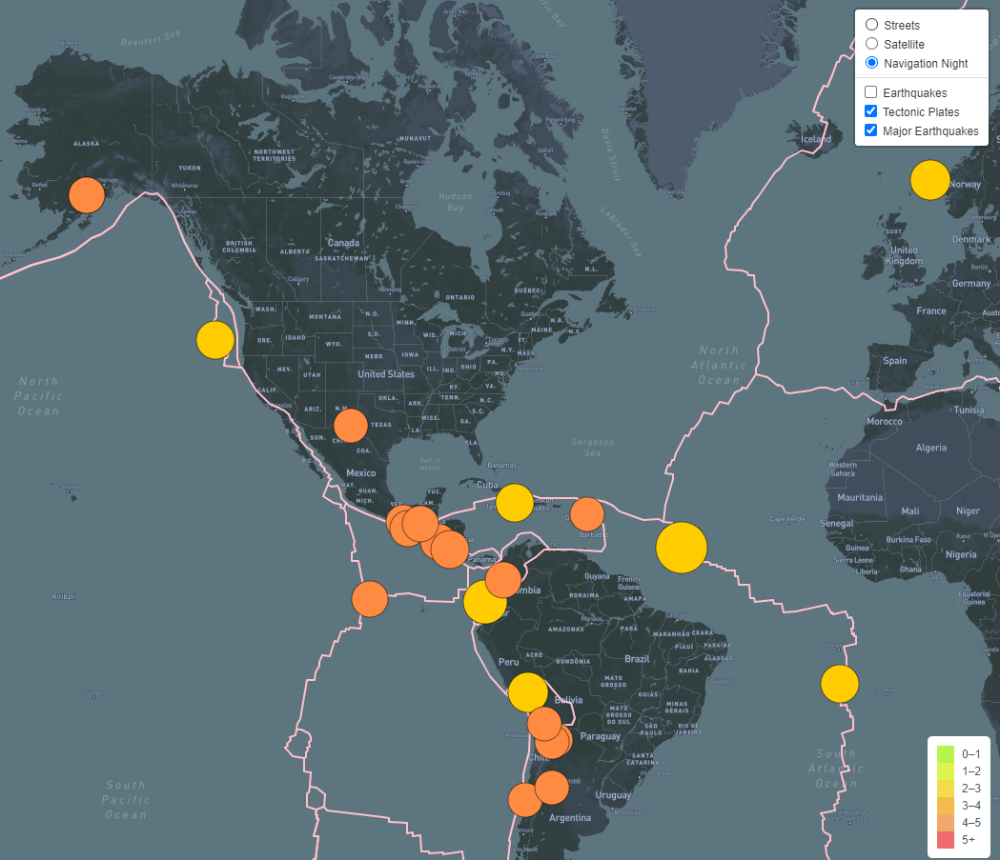
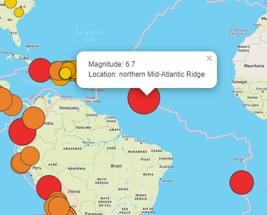
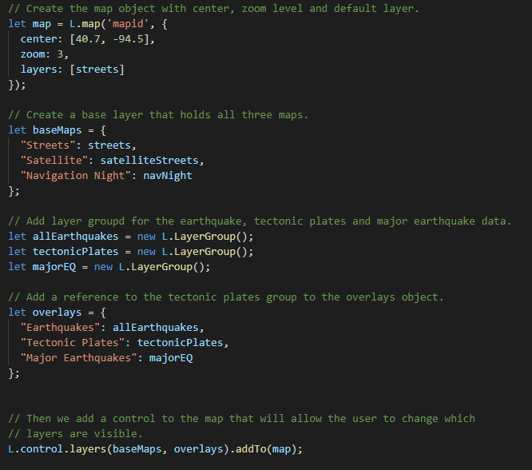
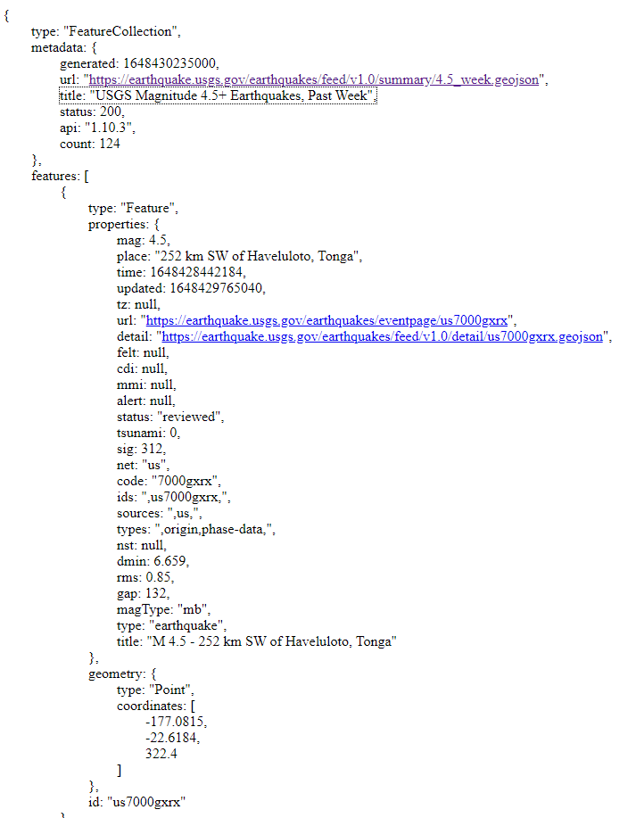

# Mapping_Earthquakes
## Overview of the Project
The purpose of this project was to visually show the differences between the magnitudes of earthquakes all over the world for the last seven days.  To complete this project, a URL for GeoJSON earthquake data from the USGS website was used to retrieve the geographical coordinates and magnitudes of the earthquakes.  Subsequently, this data was then added to a map for viewing.  The method for completing this task was done using JavaScript and the D3.js library to retrieve the coordinates and magnitudes of the earthquakes from the GeoJSON data. Then the Leaflet library was employed to plot the data on a Mapbox map through an API request and also used to create interactivity for the earthquake data.

## An Interactive Website
The completed web site plots the location of earthquakes that have occurred during the last seven days and colors and sizes the markers according to magnitude. In addition to world geographical information, there are also tectonic plate lines and a legend located on the map.  The tectonic plate lines show the most likely location for earthwquakes to occur and the legend shows how the marker colors relate to earthquake magnitude. A screen shot of the full web site can be seen in the screenshot below. 

The upper right corner of the page includes options to choose between three types of maps: streetview, satellite, or navigation night. Additionally, there are options to toggle on or off 1) all earthquakes, 2) tectonic plate lines, and 3) major earthquake information data from the map.  A screenshot of the map below shows the "navigation night" map background has been chosen and the "all earthquakes" option has been turned off.  

Pop-ups have been bound to the markers which tell the magnitude and location of each earthquake.  A screenshot of a selected marker is shown below.

## Coding Examples
The Mapping Earthquakes web site was made with a combination of HTML, JavaScript and CSS coding utilizing a Leaflet library and ultimately placed on a Mapbox map.  Below is a screenshot of some of the JavaScript coding where the map and its layers are being created.  

In order to get real-time data, an API is used to get data from the United States Geological Survey (USGS).  A sample of the JSON data retrieved is shown in the screenshot below.  This data is parsed and a portion of it is formated and displayed on the map.  

